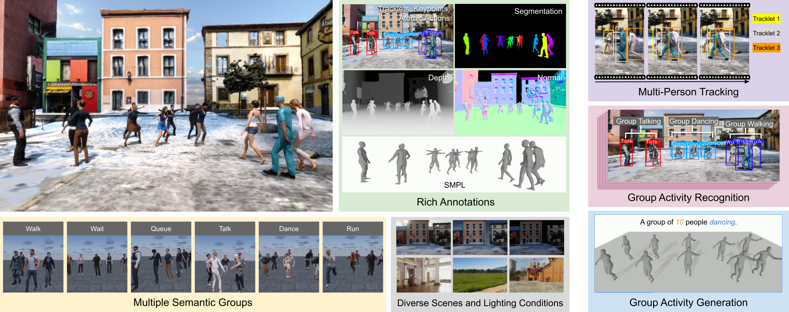

# M3Act: Learning from Synthetic Human Group Activities

**[CVPR 2024](https://cvpr.thecvf.com/) | Official Repository**


[](https://cjerry1243.github.io/M3Act/)
[](https://arxiv.org/abs/2306.16772)
[](https://arxiv.org/abs/2306.16772)

This repository contains a Unity project with the core modules and assets for our synthetic data generator, M3Act. 
We also release the 3D group activity dataset, M3Act3D, as well as the essential tools for data processing, visualization, and evaluation of the dataset.

## Introduction
**TLDR**. M3Act is a synthetic data generator with multi-view multi-group multi-person atomic human actions and group activities.

M3Act is designed to support multi-person and multi-group research. It features multiple semantic groups and produces highly diverse and photorealistic videos with a rich set of annotations suitable for human-centered tasks including multi-person tracking, group activity recognition, and controllable human group activity generation.

## Synthetic Data Generator
Coming up soon!


## 3D Group Activity Generation
Coming up soon!


## Citation
If you find our work useful, please cite our work.
```BibTeX
@misc{chang2023learning,
      title={Learning from Synthetic Human Group Activities}, 
      author={Che-Jui Chang and Danrui Li and Deep Patel and Parth Goel and Honglu Zhou and Seonghyeon Moon and Samuel S. Sohn and Sejong Yoon and Vladimir Pavlovic and Mubbasir Kapadia},
      year={2023},
      eprint={2306.16772},
      archivePrefix={arXiv},
      primaryClass={cs.CV}}
```

## License
This project is licensed under the [Creative Commons Attribution-NonCommercial 4.0 International License (CC BY-NC 4.0)](https://creativecommons.org/licenses/by-nc/4.0/).
See the [LICENSE](LICENSE) file for more details.

